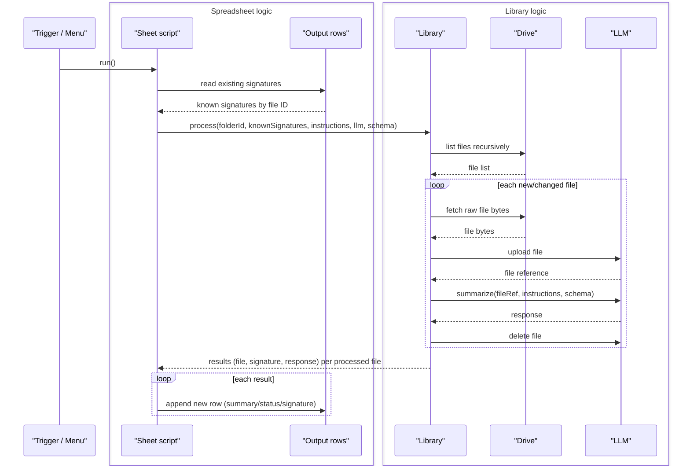

# gdrive-file-summarizer

Google Apps Script project that scans a Google Drive folder, summarizes each file's content
using an LLM, and writes the results to a Google Sheet, one row per file.

## Example

Point it at a Google Drive folder containing personal documents. Each file in the folder gets
analyzed and summarized, and all summaries are collected in a single spreadsheet, one row per
file.

## Usage

### LLM Configuration

#### Gemini

**Via Google AI Studio:**

1. Go to [Google AI Studio](https://aistudio.google.com/app/apikey).
2. Sign in with the Google account whose Drive folder you want to summarize.
3. Click **Create API key**, then pick or create a Google Cloud project to attach it to.
4. Copy the generated key.

**Via Google Cloud Console** (if you already have a project there, e.g. one with billing already
set up):

1. Go to the [Google Cloud Console](https://console.cloud.google.com/), and make sure the project
   selector at the top shows the project you want the key on.
2. Click **Create Gemini API key**.
3. Copy the generated key.

Either path produces the same kind of key, scoped to whichever project you picked or had selected.

> [!NOTE]
> A key on the free tier lets Google use your submitted content to improve their products. Enable
> billing on the project the key belongs to if you want that turned off, without changing anything
> else about the key.

## Design

One shared library serves every consuming Sheet. Each Sheet supplies its own folder, instructions,
and LLM settings, and owns the output rows.

### Decisions

- **Shared library.** The core logic lives in an Apps Script library, developed with `clasp` and
  deployed as versioned releases. Each consuming Sheet pins a specific library version.
- **Consumer sheet.** Each Google Sheet has a bound script that holds its own config: the base
  Drive folder (traversed recursively), summarization instructions (which can vary by file
  mimetype), the expected response schema, and LLM provider settings.
- **Credentials.** The LLM API key is stored in User Properties, never in a cell.
- **Triggers.** Both a time-driven trigger and a manual menu item call into the same entry point.
- **Google Workspace files.** Docs, Sheets, Slides, and other native Google formats are skipped
  entirely rather than processed. They only exist as an on-demand export, and there's no way to
  fetch that export in ranged chunks.
- **No direct spreadsheet access.** A library isn't a container-bound script, so it can't read or
  write the calling Sheet itself. The Sheet script reads its own hidden signature column and
  passes the known signatures into the library call, then takes the library's return value and
  writes it back.
- **Skip logic.** For each file, the library compares a configurable version signature (e.g.
  `lastModified`, a content hash, or another property) against the signatures passed in by the
  Sheet script, and only processes files that are new or changed.
- **LLM call.** The library uploads each file's raw bytes to the LLM provider, then asks the LLM
  to summarize by referencing the uploaded file rather than sending it inline. This relies on the
  provider's own multimodal handling rather than per-mimetype extraction in the library. The exact
  upload mechanism is provider-specific.
- **Cleanup.** Once the response comes back, the library deletes the uploaded file instead of
  leaving a copy of a personal document on the provider's servers.
- **Response handling.** The Sheet script passes in the response schema it wants back, and the
  library returns a matching parsed response for each processed file. The Sheet's own bound script
  turns those responses into a new row with the summary, status/error, and signature columns,
  since that logic is specific to each Sheet.
- **Execution limits.** Not addressed for now: since only new or changed files are reprocessed on
  each run, Apps Script's 6-minute execution limit is not expected to be an issue in steady state.
